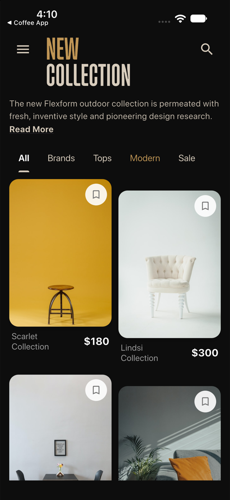
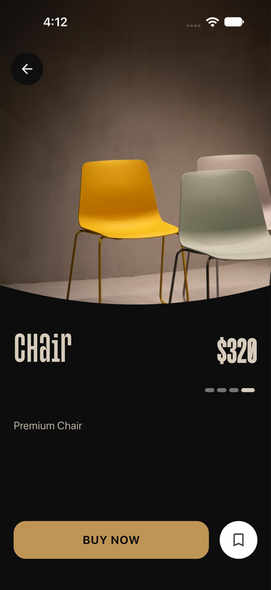

# Furniture App UI

A Flutter mobile e-commerce interface designed for exploring luxury furniture collections, featuring custom typography, responsive grid layouts, and animated product detail sheets.

[](https://flutter.dev/)
[](https://dart.dev/)
[](https://flutter.dev/)
[](LICENSE)
[](https://ghost-9.github.io/Furniture-App-UI/)

---

## Screenshots

<div align="center">
  <table>
    <tr>
      <td width="50%" align="center">
        <strong>Catalog & Story Browse</strong><br /><br />
        
      </td>
      <td width="50%" align="center">
        <strong>Product Detail Sheet</strong><br /><br />
        
      </td>
    </tr>
  </table>
</div>

---

## Features & Implementation

* **Responsive Layouts:** Uses relative screen geometry and `SafeArea` boundaries to adapt across compact, standard, and large mobile displays without RenderFlex overflows.
* **Custom Typography:** Integration of bespoke headline type (`Monologue`) alongside crisp body text.
* **Curved Detail Sheets:** Bottom modal inspection views with material specs, dimension details, and cart actions.
* **Modernized SDK:** Upgraded to modern Flutter/Dart dependencies and Xcode targets with zero analyzer warnings.
* **Automated Layout Tests:** Includes widget tests validating catalog rendering and multi-device viewport constraints.

---

## Project Structure

```
lib/
├── main.dart             # Application root and navigation routing
├── screens/              # Catalog and product detail screens
├── widgets/              # Reusable story cards, badges, and headers
└── models/               # Furniture item data models
test/
└── widget_test.dart      # Viewport and layout widget tests
docs/
└── screenshots/          # Application screenshots
```

---

## Getting Started

### Prerequisites
* Flutter SDK (3.24+)
* Xcode or Android Studio

### Installation & Run

1. Clone the repository:
   ```bash
   git clone https://github.com/Ghost-9/Furniture-App-UI.git
   cd Furniture-App-UI
   ```

2. Install dependencies:
   ```bash
   flutter pub get
   ```

3. Run widget tests:
   ```bash
   flutter test
   ```

4. Launch on simulator or device:
   ```bash
   flutter run
   ```

---

## License

This project is licensed under the [MIT License](LICENSE).
